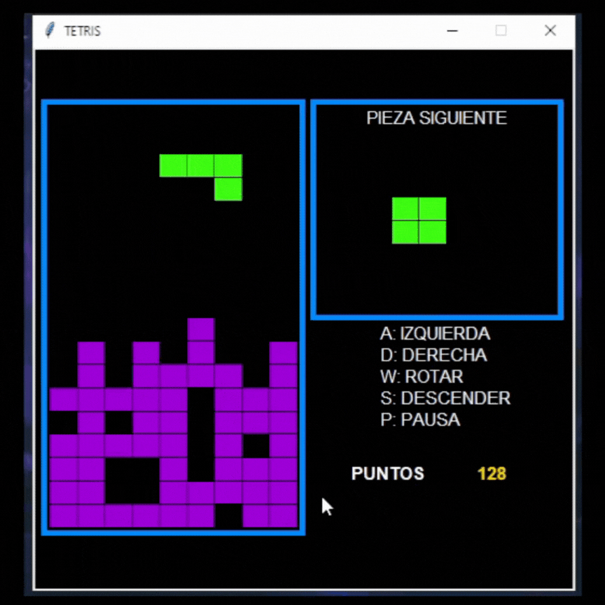

# Tetris Game 🎮

Welcome to **Tetris**, a classic puzzle game where you arrange falling blocks to clear lines and score points. This project is an implementation of the iconic game in Python, developed using object-oriented programming principles.

## 📜 Table of Contents

- [Features](#features)
- [Installation](#installation)
- [Usage](#usage)
- [Demo](#demo)
- [File Structure](#file-structure)
- [Technologies](#technologies)
- [Contributing](#contributing)
- [About This Project](#about)
- [License](#license)
- [Security Policy](#security-policy)
- [Code of Conduct](#code-of-conduct)

## 🕹️ Features <a name="features"></a>

- Classic Tetris gameplay
- Random piece generation from a predefined set
- Score system with database storage
- Graphical interface with intuitive controls

## 🚀 Installation <a name="installation"></a>

To run this project locally, follow these steps:

1. Clone the repository:
   ```bash
   git clone https://github.com/SebaB29/Tetris.git
   ```

2. Navigate to the project directory:
   ```bash
   cd Tetris
   ```

3. Run the game:
   ```bash
   python main.py
   ```

## 🎮 Usage <a name="usage"></a>

Use the following controls to play the game:

- **A**: Move left
- **D**: Move right
- **W**: Rotate piece
- **S**: Drop piece quickly
- **P**: Pause

## 📽️ Demo <a name="demo"></a>



## 📁 File Structure <a name="file-structure"></a>

The project structure is as follows:

```
Tetris/
├── .github/
│   ├── CODE_OF_CONDUCT.md
│   ├── CONTRIBUTING.md
│   ├── SECURITY.md
│   └── ISSUE_TEMPLATE/
│       └── bug_report.md
├── graphics/
│   ├── gamelib.py
│   └── tetris_gui.py
├── img/
│   └── TetrisDemo.gif
├── resources/
│   └── piezas.txt
├── src/
│   ├── constantes.py
│   ├── generador_pieza.py
│   ├── pieza.py
│   ├── sistema_puntaje.py
│   ├── tablero.py
│   └── tetris.py
├── main.py
├── README.md
├── LICENSE
└── .gitignore
```

- **graphics/**: Contains graphical libraries for rendering the game.
- **img/**: Includes a demo GIF showcasing the game's functionality.
- **resources/**: Contains the pieces configuration file (`piezas.txt`).
- **src/**: Includes source code files responsible for various game functionalities.
- **main.py**: The entry point of the application.

## 🛠️ Technologies <a name="technologies"></a>

This project is built with:

- Python
- SQLite3 (for score management)
- [Gamelib](https://github.com/dessaya/python-gamelib) (A library created by the instructor to facilitate the use of threads and rendering for the interface)

## 🤝 Contributing <a name="contributing"></a>

Contributions are welcome! Please check the [CONTRIBUTING.md](.github/CONTRIBUTING.md) file for detailed guidelines on how to contribute.

1. Fork the repository  
2. Create your feature branch (`git checkout -b feature/AmazingFeature`)  
3. Commit your changes (`git commit -m 'Add some AmazingFeature'`)  
4. Push to the branch (`git push origin feature/AmazingFeature`)  
5. Open a pull request

## 📚 About This Project <a name="about"></a>

This project was developed as a practical assignment for university. It aims to implement the classic Tetris game using Python, focusing on game logic, graphical interface, and data management through object-oriented programming principles.

## 📄 License <a name="license"></a>

Distributed under the MIT License. See `LICENSE` for more information.

## 🔐 Security Policy <a name="security-policy"></a>

Please review our [SECURITY.md](.github/SECURITY.md) for security-related information and how to report vulnerabilities.

## 📜 Code of Conduct <a name="code-of-conduct"></a>

This project follows the [Contributor Covenant Code of Conduct](.github/CODE_OF_CONDUCT.md). By participating, you agree to abide by its guidelines.
